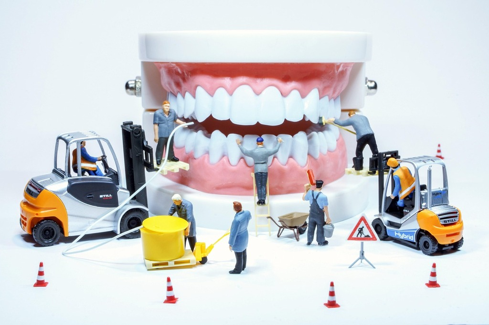
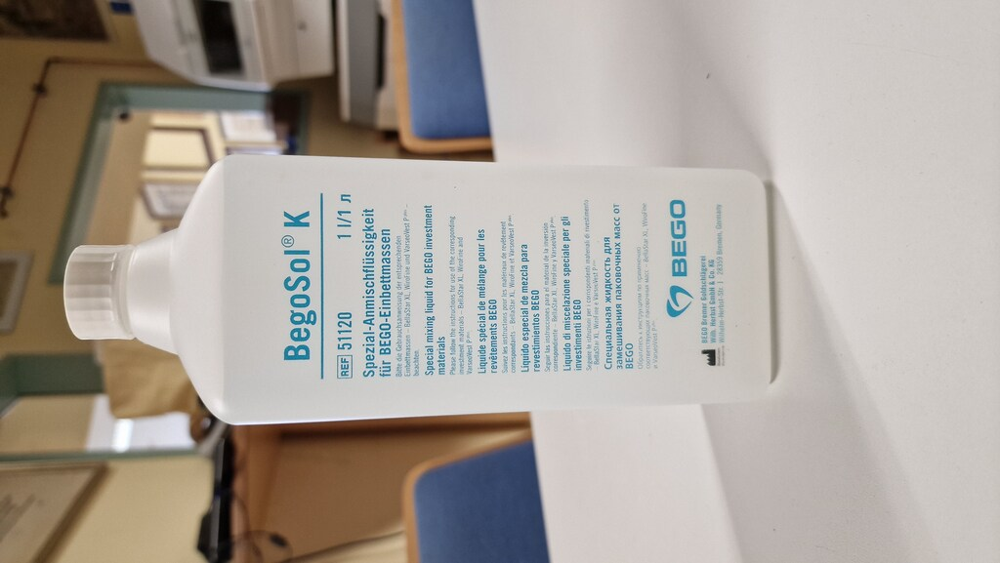
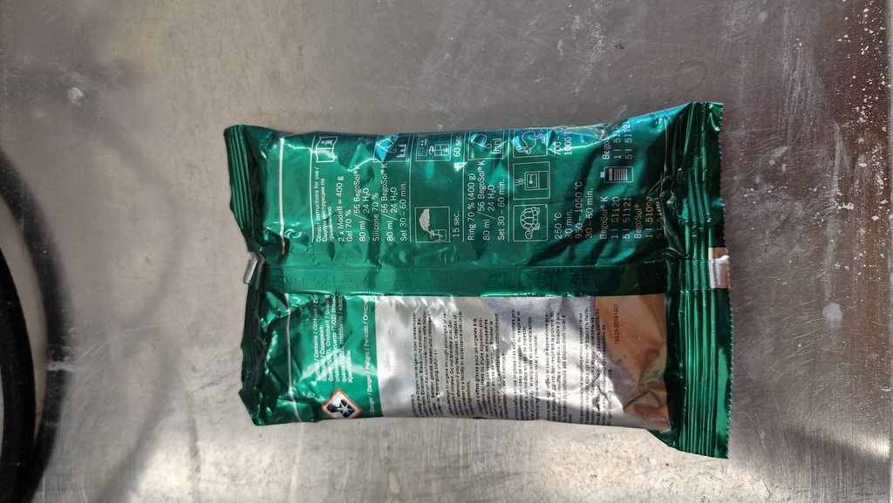

<!--
author:    Hilke Domsch; Alexander Meiwald
email:     hilke.domsch@gkz-ev.de
date:      2025-08-07
version:   0.0.4

narrator:  Deutsch male
language:  de

edit:      https://github.dev/Ifi-DiAgnostiK-Project/Zahntechnik/blob/main/materials/zahntechniker_einbettmasse.md

icon:      ../assets/img/Logo_234px.png
logo:      ../assets/img/dentures-3532982_640.jpg

title:     Einbettmassen - Zahntechnik ZAHN 2-23
comment:   Berechnung von Mischungen bei Einbettmassen
attribute: logo image pixabay by user Elbo
           https://pixabay.com/de/photos/zahnersatz-zahnarzt-gesundheitswesen-3532982/
tags:      Zahntechniker,
           Zahnersatz,
           Prothese,
           Zahnprothese,
           Einbettmassen,
           Dreisatz

link:      style.css
import:    https://raw.githubusercontent.com/Ifi-DiAgnostiK-Project/LiaScript_DragAndDrop_Template/refs/heads/main/README.md
           https://raw.githubusercontent.com/Ifi-DiAgnostiK-Project/Piktogramme/refs/heads/main/makros.md
           https://raw.githubusercontent.com/Ifi-DiAgnostiK-Project/Textilpflegesymbole/refs/heads/main/makros.md
           https://raw.githubusercontent.com/Ifi-DiAgnostiK-Project/LiaScript_ImageQuiz/refs/heads/main/README.md
           https://raw.githubusercontent.com/Ifi-DiAgnostiK-Project/Bildersammlung/refs/heads/main/makros.md
-->

# Mini-Lernkurs: Berechnung von Anmischflüssigkeiten für Einbettmassen (ZAHN 2-23)

Für den überbetrieblichen Ausbildungskurs ZAHN 2-23, in Vorbereitung auf Ihre Prüfung sowie für Ihren Arbeitsalltag können Sie in diesem Kurs wichtige Grundlagen zur Berechnung von Mischungen für Einbettmassen wiederholen.  

Als mathematische Grundlage wird der **Dreisatz**<!--style="color:blue; font-weight:bolder;"--> angewandt.  

Die richtige Mischung von __Sheraliquid__<!--style="color:blue; font-weight:bolder;"--> und<!--style="color:blue; font-weight:bolder;"--> destilliertem<!--style="color:blue; font-weight:bolder"--> Wasser<!--style="color:blue; font-weight:bolder;"--> ist entscheidend für

<section class="flex-container">

✔️ die Verarbeitbarkeit

✔️ die Abbindezeit

✔️ die Passgenauigkeit von Gussobjekten

Fehler<!--style="color:red; font-weight:bolder;"--> beim Anmischen führen oftmals zu

❗ Rissen

❗ Ungenauigkeiten

❗ unbrauchbaren Werkstücken

</section>

  __Frischen Sie Ihr Wissen auf und üben Sie Dreisatzrechnungen im zahntechnischen Alltag!__

 

<!-- style="width: 700px" -->

_Quelle: Pixabay, wir-sind-klein_

<!--style="color:blue; font-weight: bolder; font-size: large"-->Viel Erfolg!

## Der Berechnungsweg - Dreisatz

🔎 Ausgangssituation<!--style="color:blue; font-weight: bolder; font-size: large"-->

* Einbettmasse<!--style="color:black; font-weight: bolder"-->:<!--style="color:black; font-weight: bolder"--> 400 g (feste Komponente)
* Anmischflüssigkeit<!--style="color:black; font-weight: bolder"-->:<!--style="color:black; font-weight: bolder"--> 80 ml
* Vorgabe<!--style="color:black; font-weight: bolder"-->:<!--style="color:black; font-weight: bolder"--> 70%ige Lösung --> d. h. 70<!--style="color:green; font-weight: bolder"--> Teile<!--style="color:green; font-weight: bolder"--> Sheraliquid<!--style="color:green; font-weight: bolder"--> ${+}$ 30<!--style="color:blue; font-weight: bolder"-->  Teile<!--style="color:blue; font-weight: bolder"-->  destilliertes<!--style="color:blue; font-weight: bolder"--> Wasser<!--style="color:blue; font-weight: bolder"-->

---------------------

1️⃣ Grundprinzip<!--style="color:blue; font-weight: bolder; font-size: large"-->

Eine 70%ige<!--style="color:black; font-weight: bolder"--> Lösung<!--style="color:black; font-weight: bolder"--> bedeutet

* 70 % der Gesamtmenge ist Sheraliquid<!--style="color:green; font-weight: bolder"-->
* 30 % der Gesamtmenge ist destilliertes<!--style="color:blue; font-weight: bolder"--> Wasser<!--style="color:blue; font-weight: bolder"-->

Gesamtmenge in diesem Beispiel: 80<!--style="color:black; font-weight: bolder"--> ml<!--style="color:black; font-weight: bolder"-->

-------------------------

2️⃣ Rechenweg<!--style="color:blue; font-weight: bolder; font-size: large"-->

<section class="flex-container">

Sheraliquid<!--style="color:black; font-weight: bolder"-->:<!--style="color:green; font-weight: bolder"-->

${80}$ $\text{ml}$ $\text{x}$ ${0,70}$ $\text{=}$ ${56}$ $\text{ml}$

</section>

<section class="flex-container">

Destilliertes<!--style="color:black; font-weight: bolder"-->:<!--style="color:green; font-weight: bolder"--> Wasser<!--style="color:black; font-weight: bolder"-->:<!--style="color:green; font-weight: bolder"-->

${80}$ $\text{ml}$ $\text{x}$ ${0,30}$ $\text{=}$ ${24}$ $\text{ml}$

</section>

-------------------

✅ Ergebnis<!--style="color:blue; font-weight: bolder; font-size: large"-->

Für __eine Packung (400 g) Einbettmasse__ benötigen Sie:

* 56 ml Sheraliquid
* 24 ml destilliertes Wasser

----------------------

3️⃣ Wichtige<!--style="color:blue; font-weight: bolder; font-size: large"--> Wissenselemente<!--style="color:blue; font-weight: bolder; font-size: large"-->

👍 Das Mischungsverhältnis hängt immer<!--style="color:black; font-weight: bolder"--> von<!--style="color:black; font-weight: bolder"--> der<!--style="color:black; font-weight: bolder"--> geforderten<!--style="color:black; font-weight: bolder"--> Konzentration<!--style="color:black; font-weight: bolder"--> (z. B. 70 %, 50 %, 100 %) ab.

👍 Grundlage ist Dreisatzrechnung<!--style="color:black; font-weight: bolder"--> (Gesamtmenge x Anteil).

👍 Die korrekte Mischung ist entscheidend für:

✔️ die Verarbeitbarkeit

✔️ die Abbindezeit

✔️ die Passgenauigkeit von Gussobjekten

## Übungsaufgabe 1

Eine Packung Einbettmasse (400 g) wird mit 80<!--style="color:black; font-weight: bolder"--> ml<!--style="color:black; font-weight: bolder"--> einer<!--style="color:black; font-weight: bolder"--> 50%igen<!--style="color:black; font-weight: bolder"--> Lösung<!--style="color:black; font-weight: bolder"--> gemischt.

❓Wie viel ml Sheraliquid werden benötigt?

❓ Wie viel ml destilliertes Wasser werden benötigt?

<section class="flex-container" style="padding: 1rem;">

<!-- style="max-width: 150px; width: 100%" -->

<!-- style="max-width: 150px; width: 100%" -->

</section>

----------------------

<section class="flex-container border">

<!--style="color: blue; font-weight: bolder"-->Welche Gesamtmenge soll erreicht werden?

<!-- data-randomize -->
- [( )] 50 ml
- [(X)] 80 ml
- [( )] 400 ml
- [( )] 130 ml

</section>

<section class="flex-container border">

<!--style="color: blue; font-weight: bolder"-->Wie lautet der richtige Rechenweg für die Berechnung ml ~~Sheraliquid~~?

<!-- data-randomize -->
- [( )] ${80}$ $\text{ml}$ $\text{x}$ ${0,40}$
- [(X)] ${80}$ $\text{ml}$ $\text{x}$ ${0,50}$
- [( )] ${50}$ $\text{ml}$ $\text{x}$ ${0,50}$
- [( )] ${400}$ $\text{g}$ $\text{x}$ ${0,40}$

</section>

<section class="flex-container border">

<!--style="color: blue; font-weight: bolder"-->Welche Aussagen sind korrek?  

<!--style="color:red"-->Hinweis: Es sind mehrere Antworten richtig.

<!-- data-randomize -->
- [[X]] Es werden ${40}$ $\text{ml}$ Sheraliquid benötigt.
- [[X]] Es werden ${40}$ $\text{ml}$ destilliertes Wasser benötigt.
- [[ ]] Es werden ${50}$ $\text{ml}$ Sheraliquid benötigt.
- [[ ]] Es werden ${50}$ $\text{ml}$ destilliertes Wasser benötigt.
- [[ ]] Es werden ${80}$ $\text{ml}$ Sheraliquid benötigt.
- [[ ]] Es werden ${20}$ $\text{ml}$ destilliertes Wasser benötigt.

</section>

## Übungsaufgabe 2

Eine Packung Einbettmasse (400 g) wird mit 80<!--style="color:black; font-weight: bolder"--> ml<!--style="color:black; font-weight: bolder"--> einer<!--style="color:black; font-weight: bolder"--> 100%igen<!--style="color:black; font-weight: bolder"--> Lösung<!--style="color:black; font-weight: bolder"--> gemischt.

❓Wie viel ml Sheraliquid werden benötigt?

❓ Wie viel ml destilliertes Wasser werden benötigt?

<section class="flex-container border">

<!--style="color: blue; font-weight: bolder"-->Welche Gesamtmenge soll erreicht werden?

<!-- data-randomize -->
- [( )] 100 ml
- [(X)] 80 ml
- [( )] 180 ml
- [( )] 0,1 l

</section>

<section class="flex-container border">

<!--style="color: blue; font-weight: bolder"-->Wie lauten die richtigen Rechenwege für die Berechnung der benötigten ml Sheraliquid und destilliertes Wasser?

<!--style="color:red"-->Hinweis: Es sind mehrere Antworten richtig.

<!-- data-randomize -->
- [[X]] ${80}$ $\text{ml}$ $\text{x}$ ${1,00}$ = Berechnung Anteil Sheraliquid
- [[X]] ${80}$ $\text{ml}$ $\text{x}$ ${0,00}$ = Berechnung Anteil destilliertes Wasser
- [[ ]] ${180}$ $\text{ml}$ $\text{x}$ ${0,80}$ = Berechnung Anteil Sheraliquid
- [[ ]] ${180}$ $\text{ml}$ $\text{x}$ ${0,40}$ = Berechnung Anteil destilliertes Wasser
- [[ ]] ${400}$ $\text{g}$ $\text{x}$ ${0,80}$ $\text{ml}$ = Berechnung Anteil destilliertes Wasser

</section>

<section class="flex-container border">

<!--style="color: blue; font-weight: bolder"-->Welche Aussagen sind korrek?  

<!--style="color:red"-->Hinweis: Es sind mehrere Antworten richtig.

<!-- data-randomize -->
- [[X]] Es werden ${80}$ $\text{ml}$ Sheraliquid benötigt.
- [[X]] Es wird kein destilliertes Wasser benötigt.
- [[ ]] Es werden ${130}$ $\text{ml}$ Sheraliquid benötigt.
- [[ ]] Es werden ${130}$ $\text{ml}$ destilliertes Wasser benötigt.
- [[ ]] Es werden ${400}$ $\text{ml}$ Sheraliquid benötigt.
- [[ ]] Es werden ${50}$ $\text{ml}$ destilliertes Wasser benötigt.

</section>

## Übungsaufgabe 3

Für eine kleinere Arbeit werden 200<!--style="color:black; font-weight: bolder"--> g<!--style="color:black; font-weight: bolder"--> benötigt. Dazu brauchen Sie 40<!--style="color:black; font-weight: bolder"--> ml<!--style="color:black; font-weight: bolder"--> einer<!--style="color:black; font-weight: bolder"--> 70%igen<!--style="color:black; font-weight: bolder"--> Lösung<!--style="color:black; font-weight: bolder"-->.

<section class="flex-container border">

<!--style="color: blue; font-weight: bolder"-->Wie viel ml Sheraliquid und destilliertes Wasser sind anzumischen?

<!-- data-randomize -->
- [(X)] 28 ml Sheraliquid + 12 ml destilliertes Wasser
- [( )] 35 ml Sheraliquid + 5 ml destilliertes Wasser
- [( )] 20 ml Sheraliquid + 20 ml destilliertes Wasser
- [( )] 40 ml Sheraliquid + 0 ml destilliertes Wasser
- [( )] 25 ml Sheraliquid + 15 ml destilliertes Wasser
- [( )] 30 ml Sheraliquid + 10 ml destilliertes Wasser

</section>

<section class="flex-container border">

<!--style="color: blue; font-weight: bolder"-->Wie berechnet man die Menge ~~Sheraliquid~~ bei einer 70%igen Lösung mit 40 ml Gesamtmenge?

<!-- data-randomize -->
- [(X)] ${40}$ $\text{ml}$ $\text{x}$ ${0,70}$
- [( )] ${40}$ $\text{ml}$ $\text{x}$ ${0,30}$
- [( )] ${40}$ $\text{ml}$ $\text{+}$ ${0,70}$
- [( )] ${40}$ $\text{ml}$ $\text{÷}$ ${0,70}$

</section>

<section class="flex-container border">

<!--style="color: blue; font-weight: bolder"-->Wie berechnet man die Menge ~~Sheraliquid~~ bei einer 70%igen Lösung mit 40 ml Gesamtmenge?

<!-- data-randomize -->
- [(X)] ${40}$ $\text{ml}$ $\text{x}$ ${0,30}$
- [( )] ${40}$ $\text{ml}$ $\text{x}$ ${0,70}$
- [( )] ${40}$ $\text{ml}$ $\text{-}$ ${0,30}$
- [( )] ${40}$ $\text{ml}$ $\text{÷}$ ${30}$

</section>

## Geschafft! 🙌

